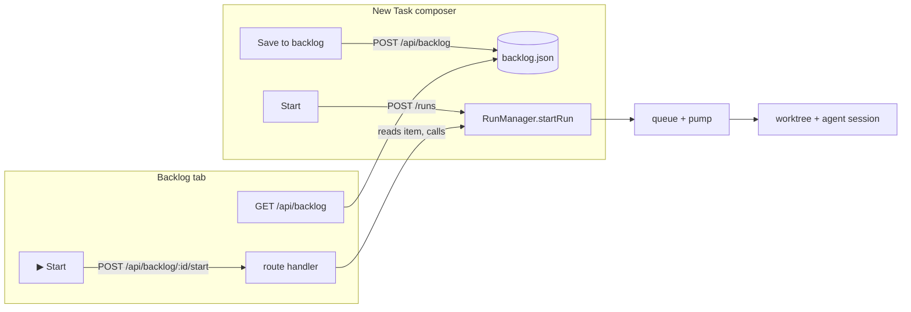

# Task backlog — save a task without dispatching it

Status: PROPOSED · FR #4

## 📝 TLDR

Today, creating a task in cezar (`cezar run`, or the web New Task composer)
always dispatches it immediately: `RunManager.startRun()` synchronously
enqueues the run and calls `pump()` in the same call, which allocates a
worktree/branch the instant a concurrency slot is free. There is no way to
type up the *next* task while the current one is still running and just have
it sit, unstarted, until a human is ready. This spec proposes a **backlog**:
a project-scoped list of saved-but-undispatched task drafts, stored in a new
file that never touches `runs.json`/`RunRecord`, with a "Save to backlog"
action in the composer and a "▶ Start" action that hands the saved input to
the exact same `startRun()` path a task takes today.

## 📝 Problem Statement

`RunStore.createRun()` hard-codes a new run's `status` to `'queued'`
(`packages/cezar/src/runs/store.ts:844`) and `RunManager.startRun()`
(`packages/cezar/src/workflows/run.ts:1145-1224`) pushes onto `this.queue`
and calls `pump()` in the same synchronous call — there is no branch that
stops at "created" without entering the dispatch queue. `RunStatus`
(`packages/contract/src/runs.ts:33-41`) has seven values
(`queued | running | waiting | review | done | failed | cancelled`); all are
states of a run that has already been handed to `RunManager`. The web New
Task composer (`packages/web/src/routes/new-task.tsx`) has exactly two submit
paths (`submit()`, `startPlanned()`), both of which call `createRun()`
(`packages/web/src/api/client.ts:1118-1123`, `POST /runs`) and navigate
straight into the launched run's thread.

The closest existing mechanism is the follow-up Inbox
(`packages/cezar/src/todos.ts`, `.ai/specs/007-handoff-file-todos.md`): an
entry sits with no run/worktree until a human clicks "▶ Run"
(`POST /api/todos/:id/start`). It doesn't solve this problem because it is
**agent-authored only** (no route for a human to add an entry from the
composer), gated behind the off-by-default `CEZ_FOLLOWUPS` capability, and
carries none of a task's composer fields (runner, model, agent profile,
attachments).

Kuba (issue #4) wants to prepare the next piece of work while the current one
is still running, without it consuming a worktree or a concurrency slot, or
appearing as an active/queued run.

## 📝 Proposed Solution

Add a **backlog** — a project-scoped list of saved `CreateRunInput`-shaped
drafts, persisted in a new file (`backlog.json`) that parallels
`todos.json`'s file shape and per-entry-tolerant parsing, but is populated by
a human directly rather than only by an agent. A backlog item never becomes a
`RunRecord` until a human clicks "▶ Start", at which point it is handed
verbatim to the *existing* `RunManager.startRun()` — the same function
`POST /runs` already calls — so every downstream mechanism (worktree
allocation, the queue, `pump()`, `maxParallel`, autosave, task naming)
applies unchanged and unmodified.

### Alternative considered and rejected: a new `RunStatus` value

The obvious-looking alternative — give `RunRecord` a `'backlog'`/`'draft'`
status and keep everything in `runs.json` — was rejected. `RunStore.open()`
parses the whole file as one array (`z.array(runRecordSchema).safeParse(raw)`,
`packages/cezar/src/runs/store.ts:730`) and, on failure, leaves `store.runs`
**empty** — there is no `else` branch that keeps the runs a stricter schema
still understood. A single run written with a status literal an older cezar's
`runStatusSchema` doesn't recognize would silently drop **every** run in the
file for that reader, exactly the failure mode
`BACKWARD_COMPATIBILITY.md` §3 calls out ("a required new field silently
drops every pre-existing run") — except here it would be a value change, not
a field, and no `storedRunnerSchema`-style widen-and-fold is possible
*retroactively* on code already shipped to users. A separate, brand-new file
carries none of this risk: an old cezar has never heard of `backlog.json` and
never opens it, the same non-event `tmp/<runId>/` already is for a version
that doesn't know about it.

## 📝 Architecture



- New module `packages/cezar/src/backlog.ts`, a straight structural port of
  `packages/cezar/src/todos.ts`: `backlogItemSchema`, `backlogPath(dataDir)`,
  the same 15-line `withLock` port, atomic tmp+rename read/write, and
  per-entry-tolerant parsing (a malformed entry is skipped with a warning,
  never fails the whole file — todos.ts's own convention, one step safer than
  `runs.json`'s all-or-nothing parse).
- New server routes on the existing per-project router, next to the
  `/api/todos/*` routes: `GET/POST /api/backlog`, `DELETE /api/backlog/:id`,
  `POST /api/backlog/:id/start`. The `start` handler reads the stored item,
  builds a `StartRunInput` from it (same shape `POST /runs`'s handler already
  builds), calls `manager.startRun(workflow, input)` — the identical call
  `server.ts:3911` makes today — then stamps the item `startedRunId` (mirrors
  `todos.ts`'s `startedTaskId`) instead of deleting it, so a "Started"
  section can show provenance the same way the Inbox does.
- No change to `RunRecord`, `RunStatus`, `RunStore`, `RunManager.startRun()`,
  `pump()`, or worktree allocation (`createWorktree` is called from
  `execute()`, `packages/cezar/src/workflows/run.ts:3834`, never from
  `startRun()` itself — a backlog item that never reaches `startRun()` never
  gets a worktree, so 006's "always worktree, no choice" invariant is
  untouched for every run that *is* dispatched).
- Web: `packages/web/src/routes/new-task.tsx` gains a third submit action,
  `saveToBacklog()`, alongside `submit()`/`startPlanned()`, calling a new
  `createBacklogItem()` client function (`packages/web/src/api/client.ts`,
  same shape as `createRun()`) and navigating to the Backlog tab instead of a
  run thread. `packages/web/src/routes/tasks-overview.tsx` gains a third
  `view` value, `'backlog'`, alongside today's `'active' | 'archived'`
  (`OverviewTab`, `tasks-overview.tsx:156-161`); its rows are backlog items,
  not `RunRecord`s, so they render through a new lightweight `BacklogList`
  component rather than `taskTreeRows` — no change to the existing
  active/archived row/column logic.

## 📝 Data Model

`packages/cezar/src/backlog.ts`:

```ts
export const backlogItemSchema = z.object({
  id: z.string().min(1),
  createdAt: z.string(),
  title: z.string().min(1).max(200),
  // Everything startRun() needs, reusing the wire shape POST /runs already
  // validates — createRunInputBaseSchema minus variants/dispatch (Phase 2).
  input: createRunInputBaseSchema.omit({ variants: true, dispatch: true }),
  startedRunId: z.string().optional(),
});
```

`backlog.json` — array of `BacklogItem`, one file per project data dir,
alongside `todos.json` and `runs.json`. Pasted attachments (`input.images`)
are persisted to stable URLs **at save time**, via the same
`persistPastedAttachments` routine `startRun()` already calls for a queued
run's initial images (`run.ts:1200-1205`) — so a backlog item never holds raw
base64 and its attachments survive exactly as long as any other saved
attachment does today.

## 📝 API Contracts

- `POST /api/backlog` — body: `createRunInputBaseSchema` minus
  `variants`/`dispatch`, plus optional `title` (defaults to the same
  heuristic `makeRunTitle` uses). Returns the created `BacklogItem`.
- `GET /api/backlog` — list items without `startedRunId`, newest first.
- `DELETE /api/backlog/:id` — remove an item (idempotent).
- `POST /api/backlog/:id/start` — 404 for an unknown id; the workflow
  resolution errors `POST /runs` already returns (unknown workflow name) are
  reused verbatim. On success: creates the run exactly as `POST /runs` would,
  stamps `startedRunId` on the backlog item, returns the new `RunRecord`.

## 📝 UI/UX

- **New Task composer:** a third button, "Save to backlog", next to
  "Start"/"Start planned". Disabled exactly when "Start" is (no task text).
  On success, navigate to the Backlog tab; the item appears at the top.
- **Backlog tab** (`Tasks` page, third tab after Active/Archived): a flat
  list — title, relative created-at, runner/model badges (reusing the
  existing badge components), "▶ Start" and a delete (trash) action. No
  worktree/diff/cost/steps columns — none exist yet for an unstarted item.
  Empty state: "Nothing backlogged yet" (mirrors the existing "Nothing
  archived yet" copy in `tasks-overview.tsx:346`).
- Skip mockups for this spec: the Backlog tab reuses the existing
  Active/Archived tab chrome verbatim and the composer button reuses the
  existing Start button's row — both are the "standard CRUD" case
  `om-auto-write-spec`'s mockup step explicitly allows skipping.

## 📝 Edge Cases & Failure Scenarios

- **Workflow no longer resolves at Start time** (renamed/deleted since save):
  `POST /api/backlog/:id/start` returns the same 400 `POST /runs` gives for
  an unknown workflow today; the item stays in the backlog, unconsumed.
- **Double-click Start:** the per-project `withLock` (ported from
  `todos.ts`) serializes `start` calls on the same id; a second call after
  `startedRunId` is stamped 404s with "already started" rather than creating
  a duplicate run.
- **Project/data dir deleted:** `backlog.json` is removed with it, the same
  lifecycle `runs.json`/`todos.json` already have — no special handling.
- **Concurrency at Start:** starting a backlog item calls the identical
  `startRun()` every other task uses, so it queues and respects
  `maxParallel` exactly like a freshly created task — no new concurrency
  logic.
- **Attachment referenced only by a backlog item:** verified there is no
  cross-run orphan-attachment sweep in this codebase today (only a per-edit
  cleanup, `run.ts:2928-2933`, scoped to a single run's own stacked
  messages) — a backlog item's persisted images are not at risk of being
  swept by an unrelated process.

## 📝 Risks & Impact Review

- **Protected surface untouched.** `runs.json`, `RunRecord`, `RunStatus`,
  and `RunManager.startRun()`/`pump()` are read, never modified — the
  highest-risk surfaces named in `BACKWARD_COMPATIBILITY.md` §3 are
  unaffected by this change.
- **New file, new routes — additive only.** `backlog.json` and the four
  `/api/backlog/*` routes are new surfaces; an older cezar simply doesn't
  know about them, per the general additive-changes rule in
  `BACKWARD_COMPATIBILITY.md` line 5.
- **HTTP API surface grows** (`risk-high` per `SDLC.md`'s explicit list) —
  the four new routes are the main review surface; each is a thin
  read/write/delegate over `backlog.ts`, with the one meaningfully new code
  path being `start`'s reconstruction of `StartRunInput`, which must stay in
  lockstep with whatever `POST /runs`'s handler does with the same body
  today (a follow-up implementation step should extract that construction
  into one shared helper both routes call, rather than duplicating it).

## 📝 Decisions in play

No `product-brief.md` exists in this repository; this spec answers directly
to issue #4 and the Resolved assumptions below.

## Resolved assumptions (autonomous defaults)

| # | Question | Applied default | Why | Confirm? |
|---|----------|-----------------|-----|----------|
| Q1 | Should a backlog item support a formal "depends on task/backlog item #N" relationship, auto-starting when the dependency finishes? | No — pure manual save-then-start; dependency graphs are out of scope | Least new surface; issue #4's own scope section already frames this as the motivating scenario, not a requirement, and a dependency graph is a materially larger, separable feature that can be added additively later without revisiting this design | reversible |
| Q2 | Should Phase 1 support variants (×2/×3) or dispatch-tree roots for a backlogged task? | No — `backlogItemSchema.input` omits `variants`/`dispatch`; Start always creates a single ordinary run | Smallest reuse of `createRunInputBaseSchema`; both are additive to add later since `input` is a schema, not a fixed tuple | reversible |
| Q3 | Persist backlog items in `runs.json` (new `RunStatus` value) or a separate file? | Separate `backlog.json`, modeled on `todos.json` | `runs.json`'s whole-array `safeParse` means one unrecognized `status` value silently empties every run for an older reader (verified at `store.ts:730`) — a genuine, currently-undocumented compatibility hazard on a protected surface; a new file carries none of that risk | not gated — this is the safer option outright, not a coin flip |
| Q4 | Show backlog items inside the existing Active/Archived task table, or a separate tab? | Separate `'backlog'` tab/view | Active/Archived rows are `RunRecord`s rendered through `taskTreeRows`/`sortRuns`, which assume worktree/diff/cost/steps fields a backlog item doesn't have yet; forcing them into the same row type would need speculative RunRecord-shaped stand-ins | reversible |
| Q5 | Scope backlog per-project (like `todos.json`) or workspace-global (like the cross-project `runs-index`)? | Per-project | Matches `todos.json`'s existing scoping exactly; a workspace-global aggregation route is a separable addition (`GET /api/workspace/backlog-index`) if ever needed | reversible |
| Q6 | Can a human edit a backlog item's saved text/fields before Start, or is Start fire-as-saved only? | Fire-as-saved only for Phase 1; editing = delete and re-save from the composer | Smallest scope; the composer already has a "prefill from an existing item" precedent it doesn't need to grow for this (`NewTaskDraft` restores unsent composer state) that a later phase can extend into "edit backlog item" | reversible |

## 📋 Phasing

- **Phase 1** — the backlog itself: `backlog.ts`, the four routes, the
  composer's "Save to backlog" button, the Backlog tab with Start/Delete.
  Independently shippable and is this spec's full scope.
- **Phase 2 (not in this spec)** — variants/dispatch-tree roots from a
  backlog item, inline editing before Start, and any dependency-between-tasks
  modeling, should Kuba confirm that's wanted after living with Phase 1.

## 📋 Implementation Plan

1. **`packages/cezar/src/backlog.ts`** — `backlogItemSchema`, `backlogPath`,
   load/save with per-entry-tolerant parsing and atomic tmp+rename
   (structural port of `todos.ts`). Unit tests: round-trip, malformed-entry
   skip, concurrent-write serialization via `withLock`.
2. **`POST/GET /api/backlog`, `DELETE /api/backlog/:id`** on the per-project
   router. Tests: create validates against `createRunInputBaseSchema` minus
   `variants`/`dispatch`; list excludes started items; delete is idempotent.
3. **`POST /api/backlog/:id/start`** — reconstructs `StartRunInput` from the
   stored item and calls `manager.startRun()`; stamps `startedRunId`. Tests:
   unknown id → 404; unresolved workflow → the same 400 `POST /runs` gives;
   double-start → second call 404s; successful start produces a `RunRecord`
   indistinguishable from one `POST /runs` created directly.
4. **`createBacklogItem()`** in `packages/web/src/api/client.ts` and the
   composer's "Save to backlog" button in `new-task.tsx`, persisting pasted
   attachments the same way `submit()` already does before calling the API.
5. **Backlog tab** — `'backlog'` view in `tasks-overview.tsx`, the
   `BacklogList` component (title, created-at, runner/model badges, ▶ Start,
   delete), empty state. Start calls `POST /api/backlog/:id/start` and
   navigates into the newly created run's thread, matching today's
   post-create navigation.
6. **Extract the shared `StartRunInput`-from-body construction** used by both
   `POST /runs` and `POST /api/backlog/:id/start` into one helper, so the two
   routes cannot silently drift on what a "task" is allowed to carry.
